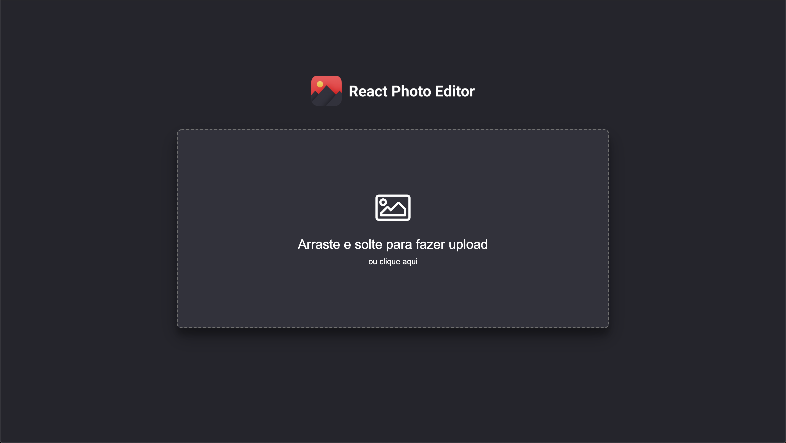

<h1 align="center">
    
</h1>

<h4 align="center">
  🚀 React Photo Editor
</h4>

  

  

  

  

  

  <a href="#rocket-tecnologias">Tecnologias</a>&nbsp;&nbsp;&nbsp;|&nbsp;&nbsp;&nbsp;
  <a href="#-projeto">Projeto</a>&nbsp;&nbsp;&nbsp;|&nbsp;&nbsp;&nbsp;
  <a href="#-layout">Layout</a>&nbsp;&nbsp;&nbsp;|&nbsp;&nbsp;&nbsp;
  <a href="#memo-licença">Licença</a>

 

  

  

  

  

## :rocket: Tecnologias

Esse projeto foi desenvolvido com as seguintes tecnologias:

- [Node.js](https://nodejs.org/en/)
- [ReactJS](https://reactjs.org)

Bibliotecas:

  - [EditorConfig](https://editorconfig.org/)
  - [ESLint](https://eslint.org/)
  - [Prettier](https://prettier.io/)
  - [Lottie](https://airbnb.design/lottie/)
  - [Redux](https://redux.js.org/)
  - [Redux](https://redux.js.org/)
  - [React DnD](https://react-dnd.github.io/react-dnd/)
  - [Material UI](https://material-ui.com/)

## 💻 Projeto

Esse projeto surgiu durante um trabalho acadêmico de Processamento Digital de Imagem. A ideia é construir um editor de fotos Web. Foi escolhido o ReactJS para o desenvolvimento do front-end por questão de mais conhecimento com a lib.

## :memo: Licença

Esse projeto está sob a licença MIT. Veja o arquivo [LICENSE](LICENSE) para mais detalhes.

---

Feito com ♥ by Vinnicius Gomes
